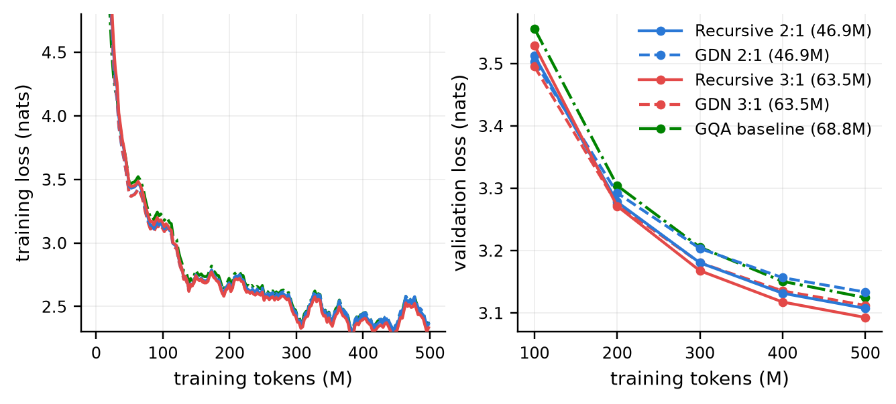
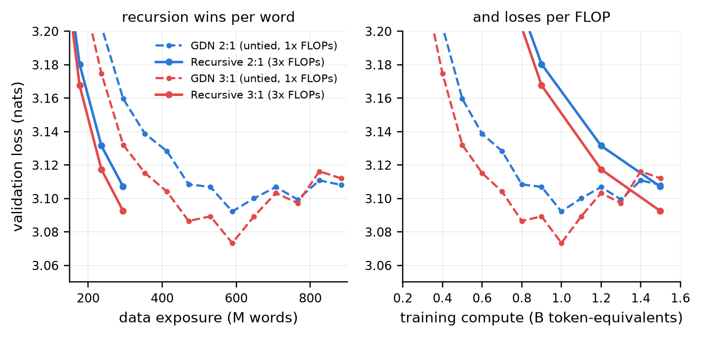
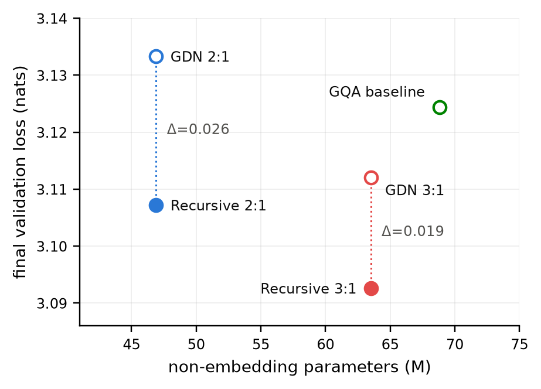

# When Does Depth Recursion Pay? A Parameter-Matched Study of Weight-Tied Hybrid Transformers on 100M Unique Words

**Anonymous ACL submission**

<!-- De-anonymize for camera-ready: restore the author line and email here,
     restore the code/artifacts link below, uncomment the Acknowledgments
     section, and switch paper/latex/main.tex from [review] to [preprint]. -->

*Submission to the BabyLM 2026 workshop (paper track). Target format: EMNLP 2026 workshop style, ≤8 pages.*

## Abstract

Weight-tied depth recursion trades computation for effective depth without adding learned parameters. We pre-train 21 hybrid Gated DeltaNet (GDN) + grouped-query attention (GQA) transformers from scratch on the BabyLM 2026 Strict corpus under one tokenizer, data order, and optimizer, and use them to ask *on which budget axis* recursion actually pays. Under a matched **data-exposure** budget, recursion is a robust win *on language-model loss*: two exact parameter-matched pairs improve validation loss by 0.0252 and 0.0195 nats (means over three training seeds; seed sd 0.0015 and 0.0005), and a domain-balanced re-evaluation over the full 17.4M-token dev set puts the advantage at 0.0270 and 0.0196 nats, positive in all six dev domains under all three seeds (36 of 36 cells). Grammatical accuracy does not support a claim either way: replicated over the same three seeds the mean zero-shot BLiMP gain is +0.58 (sd 2.44) and +1.84 (sd 2.05) points, against a seed-noise floor of up to 2.80 points sd for a *single* architecture retrained — so the +3.31 and +4.21 obtained from one seed are not separable from training noise. Under a matched **compute** budget it is not: the same non-recursive twins trained to 1B tokens, using two thirds of the recursive models' training FLOPs, beat them by 0.0117 and 0.0088 nats. Two further controls sharpen the mechanism. Untying the re-applied layers — same depth, same FLOPs, three times the parameters — recovers a further 0.0467 and 0.0399 nats, pricing what tying costs. Replacing effective-depth residual scaling with unique-depth scaling changes loss by only 0.0034 and 0.0003 nats, so the gain comes from tying rather than from the initialization the two differ in, resolving a confound our earlier design could not separate. A 25M-token checkpoint grid locates the recursive models' crossover with their twins at 75–125M tokens in the 2:1 pair, before either model has completed one pass over the corpus, ruling out repeated examples as the mechanism there; the crossover moves later as effective depth grows (18 layers ≈100M, 24 layers ≈175M), consistent with an early optimization cost. Recursion is therefore best understood as a **data-efficiency** mechanism for the fixed-corpus regime this benchmark defines, not a compute- or inference-efficiency one.

## 1 Introduction

The BabyLM challenge fixes the training data — roughly the number of words a human encounters during development — and asks what modeling choices make the most of it (BabyLM Organizing Committee, 2026). Most entries respond with data curricula or training objectives. We instead use the fixed-data setting for what it does best: making an *architectural* question unusually clean to answer.

> **If parameters are scarce, is it better to spend them on independent layers, or to re-apply a smaller stack of layers several times with tied weights?**

Weight-tied depth recursion — applying the same block of layers repeatedly — decouples a model's *effective depth* from its parameter count. The idea is old (Universal Transformers, Dehghani et al., 2019; ALBERT, Lan et al., 2020) and now spans from-scratch small models (MobileLLM-LS; Liu et al., 2024), large recurrent-depth pre-training (Geiping et al., 2025), conversion of pre-trained models (Bae et al., 2024), and adaptive recursion (Bae et al., 2025).

The question is under-specified in a way that matters. "Scarce" can mean scarce *parameters*, *compute*, or *data*, and re-applying a stack three times holds parameters fixed while tripling compute — so a parameter-matched comparison alone can only say that more layer applications beat fewer at equal weight storage, which is close to definitional. We therefore measure the same intervention against three separate budgets, and the answer differs between them.

We run the study inside a modern *hybrid* architecture that interleaves Gated DeltaNet linear-attention layers (Yang et al., 2025) with softmax grouped-query attention layers (Ainslie et al., 2023) in fixed ratios, following the design popularized by Qwen3-Next (Qwen Team, 2025). Hybrids are a natural host: a hybrid *ratio unit* (e.g., GDN–GDN–GQA) is a self-contained token-mixing block, so recursion has an obvious granularity — repeat the unit.

**Contributions.**

1. **Recursion pays per word, not per FLOP.** At matched data exposure, two exact parameter-matched pairs (46,913,888 and 63,487,504 non-embedding parameters) favour recursion by 0.0252 and 0.0195 nats. At matched compute, non-recursive twins trained longer win by 0.0117 and 0.0088 nats while using two thirds of the FLOPs. Both directions are far outside training-seed variance (§5.2, §5.3).
2. **Three seeds, six domains, and a mechanism isolated by two controls.** Every headline loss comparison is replicated across three independently seeded training runs (seed sd ≤0.0015 nats) and re-measured on every dev domain rather than a 2M-token prefix; the advantage is positive in 36 of 36 domain×seed cells and is *largest* on written text, smallest on speech (§5.2). An untied-depth arm prices what tying costs, and an initialization ablation shows the gain is not an artifact of effective-depth residual scaling (§5.4, §5.5).
3. **The crossover precedes the first epoch.** A 25M-token checkpoint grid places the 2:1 crossover at 75–125M tokens, before one corpus pass, eliminating repetition as an explanation; crossover time grows with effective depth (§5.6).
4. **BLiMP is too seed-noisy at this scale to carry an architectural claim.** Retraining one architecture under a different seed moves macro-accuracy by up to 5.56 points (sd 2.80), which swamps every architectural contrast in our grid. Our own previously reported +3.31 does not survive replication. We report the noise floor so others can calibrate against it (§5.7).

**Evaluation note.** A training-time logger averaged per-*batch* means with batch size tied to a memory setting, biasing four logged losses by about −0.025. That logger has since been fixed to weight by rows; every validation number below is recomputed from checkpoints with uniform per-token weighting regardless. Appendix A documents the pitfall, its fix, and the calibration confirming both.

**Code and artifacts.** Source code, evaluation artifacts, and reproduction scripts will be released on publication; the repository link is withheld for anonymous review.

## 2 Related Work

**Parameter sharing across depth.** Universal Transformers (Dehghani et al., 2019) apply one block recurrently with adaptive halting; ALBERT (Lan et al., 2020) ties encoder layers. Most directly, MobileLLM-LS pre-trains 125M- and 350M-parameter decoder-only models with immediate block-wise sharing and reports downstream gains (Liu et al., 2024). Geiping et al. (2025) scale a recurrent-depth decoder to 3.5B parameters and 800B tokens with variable test-time recurrence. Relaxed Recursive Transformers convert pre-trained models and soften ties with layer-wise LoRA (Bae et al., 2024), while Mixture-of-Recursions learns token-specific depths (Bae et al., 2025). These studies establish that sharing works; none separates the parameter, compute, and data axes under a fixed corpus, which is what the BabyLM setting makes possible and what we do here.

**Subquadratic token mixers at BabyLM scale.** This is not the first BabyLM entry to replace or dilute softmax attention. Haller et al. (2024) introduced BabyHGRN, which uses the HGRN2 recurrent architecture and outperformed transformer and other subquadratic baselines (LSTM, xLSTM, Mamba) under the 2024 Challenge budgets. Their follow-up, BLaLM (Haller et al., 2025), replaces self-attention with a linear-time mLSTM token mixer and adds short convolutions, sliding-window attention, and Hedgehog feature maps, reporting that linear attention combined with sliding-window attention improves zero-shot performance and that Muon converges more stably than AdamW. Our setting differs in two ways that matter for interpreting our results: we retain a *minority* of full softmax layers rather than eliminating attention, and our object of study is the re-application schedule of a fixed layer inventory rather than the mixer itself. Their results are the relevant prior for the claim that subquadratic mixers are viable at 100M words; ours addresses a question orthogonal to mixer choice.

**Linear attention and the delta rule.** DeltaNet-style linear attention maintains a fast-weight state updated by the delta rule and is parallelizable over sequence length (Yang et al., 2024). Gated DeltaNet adds a data-dependent decay gate and improves over Mamba2 and DeltaNet (Yang et al., 2025). We use the reference Triton kernels from the `flash-linear-attention` library (Yang and Zhang, 2024).

**Hybrid architectures.** A minority of softmax-attention layers interleaved with a majority of linear-attention layers preserves most of full attention's quality at a fraction of its inference cost; Qwen3-Next (Qwen Team, 2025) adopts a 3:1 Gated-DeltaNet:attention ratio at 80B scale. We evaluate 2:1 and 3:1 ratios at BabyLM scale and use the ratio unit as the unit of recursion.

**Sample-efficient pre-training.** The BabyLM workshop series (Warstadt et al., 2023; BabyLM Organizing Committee, 2026) fixes the corpus (Strict track: 100M words; repetition allowed up to 1B words of total exposure) so that architectural and algorithmic effects are comparable across submissions. Our primary runs consume ~295M words of exposure each; the compute-matched arms consume ~589M and ~884M, all within budget.

## 3 Models

All variants share one spine: a decoder-only pre-norm transformer with d_model = 768, RMSNorm (Zhang and Sennrich, 2019; ε = 1e-5), SwiGLU feed-forward blocks (Shazeer, 2020) with d_ff = 2304 (a fixed 3× multiplier for *all* variants), tied input/output embeddings, and the BabyLM-community BPE tokenizer (vocabulary 16,384). Every token-mixing layer is followed by one SwiGLU FFN sub-layer with its own residual connection.

**GQA layers** use 12 query heads and 4 KV heads of dimension 64, rotary position embeddings (Su et al., 2021) with base 10,000, and per-head RMS QK-normalization (Henry et al., 2020). Softmax attention runs FlashAttention-3 on Hopper GPUs (Shah et al., 2024) with an SDPA fallback elsewhere.

**GDN layers** are Gated DeltaNet layers (Yang et al., 2025) as implemented in `flash-linear-attention` v0.5.1: 12 heads of dimension 64, value expansion 1, output gating and short (size-4) depthwise convolutions enabled, and a delta-rule fast-weight state with data-dependent decay. GDN applies its own L2 normalization to queries and keys.

### 3.1 The variants

A *ratio unit* is (GDN, GDN, GQA) for 2:1 and (GDN, GDN, GDN, GQA) for 3:1. The non-recursive hybrids stack two units. The recursive hybrids contain **two independent super-blocks in sequence, each holding one ratio unit, each applied R = 3 times with weights tied within that super-block** (never across super-blocks). Unrolled, Recursive 2:1 computes 18 layer applications with the parameters of 6 layers — and applies softmax attention 6 times per token where its twin applies it twice.

| Variant | Attention mix | Unique layers | Eff. depth | Non-embedding params | Role |
|---|---|---|---|---|---|
| GQA baseline | pure GQA | 10 | 10 | 68,830,208 | no-GDN reference |
| GDN 2:1 | 2:1 | 6 | 6 | 46,913,888 | twin of Recursive 2:1 |
| GDN 3:1 | 3:1 | 8 | 8 | 63,487,504 | twin of Recursive 3:1 |
| **Recursive 2:1** | 2:1 | 6 | 18 | **46,913,888** | 2 SB × R=3 |
| **Recursive 3:1** | 3:1 | 8 | 24 | **63,487,504** | 2 SB × R=3 |
| Untied 2:1 deep | 2:1 | 18 | 18 | 140,740,128 | depth/FLOP-matched, untied |
| Untied 3:1 deep | 3:1 | 24 | 24 | 190,460,976 | depth/FLOP-matched, untied |
| Recursive 2:1 (unique init) | 2:1 | 6 | 18 | 46,913,888 | initialization ablation |
| Recursive 3:1 (unique init) | 3:1 | 8 | 24 | 63,487,504 | initialization ablation |

*Table 1: Model inventory. GDN 2:1 / Recursive 2:1 and GDN 3:1 / Recursive 3:1 are exact parameter-matched pairs. The untied arms deliberately are not parameter-matched: they hold depth and FLOPs fixed instead. Compute-matched arms are not new models — they are GDN 2:1 and GDN 3:1 trained to larger token budgets (§4).*

Within each matched pair the two models have identical learned layer inventories and parameter counts *to the digit*; `src/common/param_count.py` is the executable source of truth and asserts this, along with the untied arms' 3× layer scaling and the initialization ablations' parameter identity.

### 3.2 Initialization, and what it does not explain

Weights are drawn from N(0, 0.02²); residual-output projections (attention output, FFN down-projection) are scaled by 1/√(2·D_eff), where D_eff is the *effective* depth — 18 or 24 for the recursive models, the plain layer count otherwise. Using effective rather than unique depth is a principled stability choice because the same projection writes into the residual stream R times.

The matched pairs therefore differ at initialization as well as in execution, so the comparison as originally constructed identifies the recursive *configuration* rather than tying alone. The `unique init` arms are structurally identical to the recursive models — same super-blocks, same R = 3, parameter-identical to the digit — and differ only in scaling residual-output projections by 1/√(2 · unique depth), the factor their non-recursive twins use, a √3 difference. §5.5 reports the result: the initialization accounts for 0.0034 and 0.0003 nats, against recursion gains of 0.0252 and 0.0195. The confound is real but small; recursion, not depth-aware scaling, produces the effect.

Note also that the untied deep arms use 1/√(2·n_layers) with n_layers = 18 or 24, which *equals* their recursive counterparts' 1/√(2·D_eff). The untied and recursive arms therefore share an initialization scale by construction and differ only in whether weights are tied.

## 4 Experimental Setup

**Data.** We train on the official BabyLM 2026 Strict corpus (`BabyLM-community/BabyLM-2026-Strict`; six domain files, ~100M words) and validate on the official dev split (`BabyLM-community/BabyLM-dev`), excluded from the training bins at preprocessing time. Under the shared 16,384-vocabulary tokenizer, one epoch is 169,741,563 tokens (≈1.70 tokens per whitespace word).

**Recipe.** One locked recipe for every run: 4,096-token sequences, 32 sequences per optimizer step, AdamW at peak 6e-4 with cosine decay to 10%, and a 499,908,608-token primary budget (≈2.9 epochs ≈295M words). Appendix A gives the full hyperparameters and hardware.

**Seeds.** Each matched pair is trained at seeds 42, 43, and 44. A seed sets weight initialization *and* the data-order permutation together, so within a seed group all variants still see exactly the same tokens in exactly the same order — the control is preserved — while across groups the spread is genuine run-to-run training variance rather than initialization variance alone.

**Compute-matched arms.** A recursive model executes ~3× the layer FLOPs per token of its twin, so at 500M tokens it consumes ≈1.5B token-equivalents of training compute. We therefore train GDN 2:1 and GDN 3:1 to **1.5B tokens** (11,444 steps, 750 warmup, ≈884M words — exact FLOP parity) and to **1B tokens** (7,629 steps, 500 warmup, ≈589M words — two thirds of parity), each with the cosine schedule stretched to its own horizon. Warmup is rescaled to hold the warmup *fraction* constant at ≈6.5%, so each schedule is a stretched copy of the primary one. Both remain inside the Strict track's 1B-word exposure cap. The 1B arm exists because the 1.5B arm overtrains: validation loss for both twins bottoms out near 1.0B tokens and rises thereafter (§5.3), so the 1.5B endpoint understates what the twin can do with its compute, and reporting only that endpoint would flatter recursion.

**Evaluation protocol.** All validation numbers are recomputed from retained checkpoints over the same 488 non-overlapping 4,096-token windows, with uniform per-token weighting and an identical code path, for all 21 runs and all 255 checkpoints. The 2M-token prefix was fixed to bound evaluation cost, not selected by model performance. Because preprocessing concatenates sorted domain files, it comprises all 1.738M tokens of BNC Spoken and the first 0.261M tokens of CHILDES rather than a domain-balanced dev sample. **Final checkpoints are additionally scored on the whole dev set** (17,390,678 tokens; six domains; 4,243 windows, each contained within one domain) via `modal_train.py::domain_eval`, which is the source of Table 4 and of the domain-balanced figures we recommend citing; `src/common/data.py` now writes a `.domains.json` sidecar recording each source file's token range in the flat bin, and the manifest for the `val.bin` in use was verified by re-tokenizing the dev files and checking the result byte-identical (sha256 `3930eaef…`). Paired uncertainty estimates resample aligned windows; the seed-replication block reports across-seed spread separately.

**Hardware and cost.** Every run trains on a single H100-80GB (Modal). The full grid of 21 runs is ~12 GPU-hours; per-run wall clock, throughput, and peak memory are in Appendix A. All 21 runs completed with zero loss spikes.

## 5 Results

### 5.1 Overall picture

| Model | Non-emb. params | Tokens | Val loss ↓ | Val ppl ↓ | bpt ↓ | BLiMP ↑ | Suppl. ↑ |
|---|---|---|---|---|---|---|---|
| Untied 3:1 deep | 190.5M | 500M | **3.0527** | **21.17** | **4.404** | 67.50 | 59.53 |
| Untied 2:1 deep | 140.7M | 500M | 3.0605 | 21.34 | 4.415 | 68.17 | 59.26 |
| GDN 3:1 (1B, annealed) | 63.5M | 1B | 3.0838 | 21.84 | 4.449 | 67.71 | 55.95 |
| **Recursive 3:1** | 63.5M | 500M | 3.0926 | 22.03 | 4.462 | 67.48 | 55.17 |
| Recursive 3:1 (unique init) | 63.5M | 500M | 3.0929 | 22.04 | 4.462 | 67.54 | 54.55 |
| GDN 2:1 (1B, annealed) | 46.9M | 1B | 3.0955 | 22.10 | 4.466 | 65.58 | 57.95 |
| **Recursive 2:1** | 46.9M | 500M | 3.1072 | 22.36 | 4.483 | 65.56 | 53.30 |
| GDN 2:1 (1.5B) | 46.9M | 1.5B | 3.1081 | 22.38 | 4.484 | 67.56 | **60.68** |
| Recursive 2:1 (unique init) | 46.9M | 500M | 3.1106 | 22.43 | 4.488 | 65.75 | 56.08 |
| GDN 3:1 (1.5B) | 63.5M | 1.5B | 3.1120 | 22.47 | 4.490 | 66.82 | 56.32 |
| GDN 3:1 | 63.5M | 500M | 3.1121 | 22.47 | 4.490 | 63.27 | 53.93 |
| GQA baseline | 68.8M | 500M | 3.1244 | 22.75 | 4.508 | **71.07** | 59.59 |
| GDN 2:1 | 46.9M | 500M | 3.1333 | 22.95 | 4.520 | 62.24 | 52.28 |

*Table 2: All arms on the fixed dev slice, uniform per-token weighting, seed 42. Domain-balanced losses over the full dev set are in §5.2; BLiMP columns are single-seed and should be read against the seed-noise floor of §5.7. Every model in this table trained on the same 100M-word corpus; the Tokens column is exposure, not corpus size. BLiMP columns macro-average 67 paradigms / five supplement tasks.*

*Figure 1: Training and validation loss for the five primary variants. Hue encodes the ablation pair (blue = 2:1, red = 3:1, green = baseline); solid lines are recursive models, dashed their non-recursive twins. All 21 runs in the study are stable, with zero loss spikes.*

Read down the loss column and the ordering is not by parameters, not by effective depth, and not by tokens — it is by how the budget was spent. The rest of this section separates those axes. One ordering caveat: this column uses the fixed prefix slice, and on the domain-balanced metric of §5.2 the second and third places (GDN 3:1 at 2.6983, Recursive 2:1 at 2.6988) are a tie whose sign flips across seeds, so we do not read anything into their order. Recursive 3:1 is first on both metrics under all three seeds.

### 5.2 Recursion at matched exposure, across three seeds

At the shared 500M-token budget, the recursive member wins both pairs, and the effect replicates.

| Pair | seed 42 | seed 43 | seed 44 | mean | sd |
|---|---|---|---|---|---|
| 2:1 (GDN − Recursive) | +0.0261 | +0.0236 | +0.0261 | **+0.0252** | 0.0015 |
| 3:1 (GDN − Recursive) | +0.0195 | +0.0200 | +0.0190 | **+0.0195** | 0.0005 |

*Table 3: Paired recursion advantage in nats, replicated over three independently seeded training runs. Per-model seed sd ranges from 0.0005 to 0.0020.*

Within seed 42, a paired 100,000-resample bootstrap over the 488 aligned windows gives 0.0261 [0.0248, 0.0274] and 0.0195 [0.0183, 0.0207] nats, with recursion winning 480/488 and 462/488 windows (exact sign tests p = 1.92×10⁻¹³⁰ and 2.64×10⁻¹⁰⁴). The published single-seed values sit essentially on the three-seed means, so they were not fortunate draws. Establishing the seed floor at ≤0.002 nats is what makes the smaller effects below interpretable rather than suggestive.

**The advantage holds in every dev domain.** Because `prepare` concatenates the six dev files in sorted-filename order, the fixed 2M-token prefix used above is 87% BNC Spoken and 13% CHILDES; four of six domains contribute nothing to it. We therefore re-scored the final checkpoint of all thirteen 500M-token runs on the entire 17,390,678-token dev set, in windows contained within a single domain, and macro-averaged the domains into a balanced figure.

| Dev domain | Tokens | Windows | 2:1 advantage | 3:1 advantage |
|---|---|---|---|---|
| BNC Spoken | 1.74M | 424 | +0.0267 (0.0017) | +0.0207 (0.0004) |
| CHILDES | 5.84M | 1426 | +0.0139 (0.0011) | +0.0099 (0.0004) |
| Gutenberg | 3.88M | 946 | **+0.0406** (0.0021) | **+0.0310** (0.0010) |
| OpenSubtitles | 3.39M | 828 | +0.0238 (0.0018) | +0.0190 (0.0013) |
| Simple Wiki | 2.29M | 559 | **+0.0405** (0.0025) | +0.0267 (0.0048) |
| Switchboard | 0.25M | 60 | +0.0164 (0.0019) | +0.0100 (0.0024) |
| **Domain-balanced** | 17.39M | 4243 | **+0.0270** (0.0014) | **+0.0196** (0.0010) |

*Table 4: Paired recursion advantage in nats by dev domain, mean over three seeds with seed sd in parentheses. Positive favours the recursive model in every cell — 36 of 36 domain×seed×family combinations.*

Two things follow. First, the narrow slice was **conservative, not flattering**: the domain-balanced advantage (+0.0270, +0.0196) is slightly larger than the prefix figure (+0.0252, +0.0195), because the prefix is dominated by the two domains where recursion helps least. Second, the effect size is domain-structured in a way the depth account predicts — roughly 3× larger on edited written text (Gutenberg, Simple Wiki) than on conversational speech (CHILDES, Switchboard). Extra effective depth buys most where syntax is deep and dependencies are long, and least on short spoken turns. We report the prefix figures above for continuity with the checkpoint series in Figure 1, but the balanced numbers are the ones to cite.

On grammatical minimal pairs, the single-seed picture appeared to agree: +3.31 [0.38, 6.85] points for the 2:1 pair and +4.21 [2.43, 6.11] for the 3:1, with the 3:1 effect directionally broad (46 paradigms won, 20 lost, one tied; p = .0019) and the 2:1 mean driven by a positive tail (37 won, 30 lost, p = .464). Replicating both pairs across all three seeds dissolves most of this, and §5.7 reports what is left.

### 5.3 Recursion at matched compute: the advantage reverses

*Figure 2: The same intervention against two budgets. **Left:** at equal exposure the recursive models (solid) sit below their untied twins (dashed); Recursive 2:1 reaches at 295M words what its twin needs ~590M words to match. **Right:** against training compute in token-equivalents — where a recursive model costs 3× per token — the twins' curves run below the recursive endpoints, and both twins bottom out near 1.0B token-equivalents before overtraining degrades them. Hue encodes the family (blue = 2:1, red = 3:1).*

The parameter-matched comparison holds parameters and tokens fixed and lets compute vary. Inverting that, we hold compute fixed and let exposure vary.

| Family | Recursive (500M tok, 3× FLOPs) | Twin at 1.5B tok (parity) | Twin at 1B tok (⅔ parity) |
|---|---|---|---|
| 2:1 | 3.1072 | 3.1081 | **3.0955** |
| 3:1 | 3.0926 | 3.1120 | **3.0838** |

*Table 5: Validation loss under matched training FLOPs. The 1B-token arm uses two thirds of the recursive models' compute and still wins both families.*

At exact FLOP parity the 2:1 comparison is a tie (0.0009 nats) and the 3:1 favours recursion (0.0194). But that endpoint is misleading in the twin's disfavour: both 1.5B runs pass their minimum near 1.0B tokens (2:1 best 3.0922; 3:1 best 3.0733) and degrade over the remaining 500M tokens as repetition accumulates past ~6 epochs. Trained to 1B tokens with the cosine annealed to that horizon, the twins reach 3.0955 and 3.0838 — beating the recursive models by **0.0117 [0.0097, 0.0137] and 0.0088 [0.0067, 0.0111] nats while consuming two thirds of the compute**. Recursion wins only 128/488 and 160/488 windows in these contrasts. At 6–8× the seed sd, the reversal is not noise.

BLiMP agrees: against the annealed twins, recursion is level (−0.02 and −0.23 points) and loses on the supplement (−4.65 and −0.78).

Figure 2 shows both axes together. The two axes separate cleanly. Per word of exposure, recursion wins: it reaches 3.1072 on 295M words where the twin needs 589M to reach 3.0955. Per FLOP, it loses. Which conclusion matters depends on which budget binds — and on a fixed-corpus benchmark, the data budget is the one that does.

### 5.4 What tying costs

The untied deep arms hold depth, layer inventory shape, FLOPs, and initialization scale fixed, and untie the weights — trading 3× the parameters for independence.

| Contrast | Δ loss | 95% CI | Windows won | Δ BLiMP | Δ Suppl. |
|---|---|---|---|---|---|
| Untied 2:1 deep vs Recursive 2:1 | +0.0467 | [0.0447, 0.0488] | 485/488 | +2.61 | +5.96 |
| Untied 3:1 deep vs Recursive 3:1 | +0.0399 | [0.0379, 0.0419] | 485/488 | +0.02 | +4.36 |

*Table 6: The price of weight tying. Positive favours the untied model, which holds 3× the learned parameters.*

*Figure 3: The parameter–quality trade-off for the primary grid. Vertical dotted lines connect the two parameter-matched pairs; filled markers are recursive models.*

Untying is worth 0.0467 and 0.0399 nats — roughly twice the recursion gain itself, for three times the weights. Tying is thus a real compression: it forfeits about 0.04 nats and returns a 3× parameter saving. That trade is favourable in the regime this paper studies, and the clearest evidence is across architectures rather than within a pair: **Recursive 2:1, at 46.9M non-embedding parameters, reaches 3.1072 against the 68.8M-parameter GQA baseline's 3.1244** — better loss with 32% fewer learned weights. On BLiMP the picture is less uniform: untying buys 2.61 points at 2:1 but nothing at 3:1 (+0.02), while both untied arms gain 4–6 points on the supplement.

### 5.5 The initialization confound is small

| Contrast | Δ loss | 95% CI | Windows won | Δ BLiMP |
|---|---|---|---|---|
| Recursive 2:1 vs unique-init | +0.0034 | [0.0024, 0.0044] | 305/488 | −0.20 |
| Recursive 3:1 vs unique-init | +0.0003 | [−0.0007, 0.0013] | 257/488 | −0.06 |

*Table 7: Effective-depth versus unique-depth residual scaling, holding tying fixed. Positive favours effective-depth scaling.*

The 3:1 contrast is a clean null: the interval spans zero and the sign test is at chance (257/488). The 2:1 contrast is small but detectable on evaluation-sample uncertainty (+0.0034, interval excluding zero) — yet at roughly twice the seed sd of 0.0015, and with only 62.5% of windows won, it is not robustly identified either. BLiMP shows nothing in either family (−0.20, −0.06).

Effective-depth scaling therefore accounts for at most a seventh of the 2:1 recursion gain and none of the 3:1. The confound §3.2 describes exists but does not explain the result: **tying does the work**. We keep effective-depth scaling as the default on stability grounds (Appendix A reports residual-stream RMS growing smoothly across recursive passes) rather than performance ones.

### 5.6 The crossover precedes the first epoch

Both recursive models trail their twins early and lead later. On a 25M-token checkpoint grid, and in both seed replicates:

| Family | seed 43 | seed 44 | vs. epoch boundary (169.7M tokens) |
|---|---|---|---|
| 2:1 (18 effective layers) | 75–100M | 100–125M | **before** one corpus pass |
| 3:1 (24 effective layers) | 150–175M | 175–200M | at / just after |

*Table 8: Where the recursive model overtakes its twin, bracketed to 25M tokens.*

In the 2:1 pair the crossover happens while both models are still inside their first pass over the corpus, so **repeated examples cannot be the mechanism there**. The 3:1 crossover sits near the boundary and remains ambiguous with respect to it. What does vary systematically is effective depth: the 18-layer configuration crosses at ~100M tokens and the 24-layer one at ~175M, in both seeds. That ordering is what an early optimization cost predicts — deeper tied models pay more to get started and take longer to amortize it — and is not what a repetition account predicts, since both models meet the epoch boundary at the same token count.

### 5.7 Grammatical accuracy does not replicate across seeds

Validation loss and BLiMP behave completely differently under seed replication, and the difference is large enough to change what this paper claims.

| Pair | Suite | s42 | s43 | s44 | mean | sd | seeds positive |
|---|---|---|---|---|---|---|---|
| 2:1 | BLiMP | +3.31 | −1.38 | −0.18 | **+0.58** | 2.44 | 1/3 |
| 2:1 | Supplement | +1.01 | −4.82 | +2.54 | **−0.42** | 3.88 | 2/3 |
| 3:1 | BLiMP | +4.21 | +0.71 | +0.59 | **+1.84** | 2.05 | 3/3 |
| 3:1 | Supplement | +1.24 | +4.20 | −0.25 | **+1.73** | 2.26 | 2/3 |

*Table 9: Recursion advantage in macro-accuracy points, replicated over three seeds. Seed 42 — the only seed evaluated in the original submission — is the most favourable of the three in both suites.*

The cause is not a defect of any one contrast but the noise floor of the benchmark itself at this scale. Retraining a *single* architecture under a different seed, changing nothing else, moves BLiMP macro-accuracy by:

| Model | s42 | s43 | s44 | sd | range |
|---|---|---|---|---|---|
| GDN 2:1 | 62.24 | 65.60 | 67.80 | 2.80 | **5.56** |
| Recursive 2:1 | 65.56 | 64.22 | 67.62 | 1.71 | 3.39 |
| GDN 3:1 | 63.27 | 66.05 | 65.19 | 1.42 | 2.78 |
| Recursive 3:1 | 67.48 | 66.77 | 65.78 | 0.85 | 1.70 |

*Table 10: BLiMP macro-accuracy of one architecture across three training seeds. The same models' validation loss varies by ≤0.0020 nats.*

A 5.56-point swing from the seed alone is larger than any architectural difference in our grid, and it swallows two cross-architecture readings we previously drew. The pure-GQA baseline leads BLiMP at 71.07 while sitting tenth of thirteen on validation loss, a 3.59-point margin; and GDN 2:1 appeared to gain 5.32 points from exposure alone (62.24 → 67.56, 295M to 884M words), which we had called the largest movement in the grid. Both are single-seed, and both lie inside the 5.56-point spread of one architecture, so we no longer claim either. For external scale the [official BabyLM 2026 Strict GPT-2 reference](https://github.com/babylm-org/babylm-eval#strict--strict-small) reports 74.53 / 65.00, on a different architecture, recipe and exposure. Every recursion contrast in Table 9 is likewise inside it. The 2:1 recursion gain we previously reported at +3.31 is therefore withdrawn: it is one draw from a distribution whose spread exceeds it. The 3:1 gain keeps its sign in all three seeds and is the only accuracy claim we still make, at +1.84 ± 2.05 — directionally consistent, but with an interval that includes values near zero.

We state this as a finding rather than only a limitation because the same exposure applies to the wider literature: BabyLM-scale papers routinely compare architectures on single-seed BLiMP differences of one to three points. Our measurement says such differences are not resolvable without replication. Validation loss, by contrast, separated these same models at 0.0005–0.0015 nats of seed noise, and is the metric we would advise selecting on at this scale.

**The other two official zero-shot suites are also null.** We additionally evaluated all thirteen 500M-token runs on the full official COMPS and entity-tracking sets under the same causal protocol (scoring only the completion tokens, as the official evaluator does). Recursion moves COMPS by −0.23 (sd 0.45) in the 2:1 pair and +0.21 (sd 0.27) in the 3:1, and entity tracking by −0.99 (sd 1.41) and −0.10 (sd 0.55); three of the four contrasts change sign across seeds. More telling than the nulls is the absolute level: every model scores **at or below the 20% chance level on entity tracking** (16.79–19.11), which with 6,780 items is far outside binomial noise and is not a length artifact of summed-log-prob scoring — correct options and distractors both average 26.5 characters, and the correct option is longest in only 24.1% of items. The official GPT-2 Strict reference reaches 23.58 there, barely above chance itself. COMPS sits at 53.5–54.7 against a 50% floor. Neither suite discriminates among models of this size trained on this budget, so neither can bear on the architectural question; we report them for completeness rather than as evidence. Per-task numbers are in `paper/figures/zeroshot_eval.json`.

## 6 Discussion

**Recursion is a data-efficiency mechanism.** The two budget axes give opposite answers, and both are solid: +0.0252/+0.0195 nats per matched word, −0.0117/−0.0088 nats per matched FLOP. The honest summary is that tied re-application converts *additional computation* into quality at fixed parameter count, and does so less efficiently than simply training the shallower model longer would — but that under a fixed corpus, "training longer" means repeating data, and repetition has a ceiling we can see in our own runs (both 1.5B arms are past their minimum). Recursion buys quality without spending exposure. In a setting where exposure is the capped resource and compute is not, that is the useful trade; outside it, it is not.

**Parameter efficiency survives on its own terms.** Recursive 2:1 beats a 47% larger pure-attention baseline on loss, and untying costs 3× the weights to buy 0.04 nats: under a weight-storage constraint — not a latency or FLOP one — recursion remains attractive, and §5.3 delimits rather than contradicts this. The 3:1 gap is the smaller of the two, most likely because its twin is less depth-starved at 8 unique layers and because the 24-deep tied model crosses over ~75M tokens later (§5.6), leaving less budget to amortize its early deficit.

**What the initialization result means for the design.** We adopted effective-depth scaling on stability grounds and it delivered stability — 21 runs, zero loss spikes, smooth residual-RMS growth across passes. It did not deliver much accuracy (§5.5). Practitioners adopting recursion should treat depth-aware residual scaling as a stability measure, not a performance lever, and should not attribute reported recursion gains to it.

**Metric-dependent ranking, and which metric to trust.** Validation loss rewards depth and parameters; BLiMP rewards the all-attention baseline. BLiMP morphology shows the baseline's largest margin (85.60 vs 78.80 for Recursive 3:1). We had read this divergence as an argument against selecting small models on dev loss alone. Seed replication inverts that advice: at this scale dev loss resolves architectures to ~0.001 nats while BLiMP moves by several points on the seed alone (§5.7). The divergence is real, but the sharper reading is that one of the two metrics is measuring the architecture and the other is largely measuring the draw.

## 7 Conclusion

Across 21 controlled pre-training runs on the BabyLM 2026 Strict corpus, weight-tied depth recursion improves parameter-matched validation loss by 0.0252 and 0.0195 nats — replicated over three seeds, with a seed sd of 0.0015 and 0.0005 — with the same advantage present in all six dev domains under all three seeds. Grammatical accuracy does not follow: replicated across seeds the BLiMP gains fall to +0.58 and +1.84 points against a seed-noise floor of up to 2.80 points sd, so we withdraw the 2:1 accuracy claim and hold the 3:1 one weakly. Under matched training compute the advantage reverses: the same twins trained to 1B tokens win by 0.0117 and 0.0088 nats using two thirds of the FLOPs. Untying the shared layers recovers a further 0.0467 and 0.0399 nats at 3× the parameters, and effective-depth residual scaling — the one design choice that differed between our matched pairs besides tying — accounts for at most 0.0034 nats, so tying itself produces the effect. The recursive advantage emerges before the first corpus pass completes in the 2:1 pair, and its onset scales with effective depth, pointing to an early optimization cost rather than a benefit of repetition. Depth recursion pays where words are scarce and FLOPs are not. That is the regime BabyLM defines, and it is a narrower and better-supported claim than "recursion helps."

## Limitations

- **Grammatical accuracy is unresolved, not merely unreplicated.** The paired models are now evaluated at three seeds (§5.7), and the result is that BLiMP's seed noise at this scale (up to 5.56 points range for one architecture) exceeds the effects we set out to measure. We therefore make no 2:1 accuracy claim and only a weak 3:1 one. Every other model in Table 2 — the untied, unique-init, compute-matched arms and the baseline — is still evaluated at seed 42 alone, so all cross-architecture BLiMP comparisons in this paper inherit that same floor and should be read as provisional.
- **The checkpoint *series* is still on the narrow slice.** Final-checkpoint numbers are now domain-balanced over the full 17.4M-token dev set (§5.2), but the 255-checkpoint trajectories behind Figure 1, the crossover brackets of §5.6, and the compute-matched curves of §5.3 are all still computed on the 2M-token prefix, to keep evaluation cost bounded. Since the per-domain deltas are same-signed and similar in magnitude, we do not expect the trajectories to reorder, but we have not verified that at every checkpoint.
- **Fine-tuning is not run.** We report the four official zero-shot suites (BLiMP, BLiMP Supplement, COMPS, entity tracking) but none of the fine-tuning tasks, which would require a Hugging Face wrapper around our native checkpoints and an `attention_mask` argument our GQA implementation does not accept — a change to the one shared primitive all 21 runs depend on. This is a non-competition workshop paper, but the missing fine-tuning suite limits claims of BabyLM competitiveness.
- **Compute matching is by token budget, not by wall clock or architecture search.** We match FLOPs analytically (3× layer applications) and verify it against measured throughput (Appendix A), but we did not tune the learning rate per budget; all runs share the 6e-4 literature prior. A tuned longer run might favour the twins further.
- **Narrow architectural slice.** One width (768), two sizes, two hybrid ratios, R = 3 only. We do not vary R, and the untied arms exist at one depth each.
- **Inference cost is untouched.** Naively unrolled autoregressive decoding needs state for each application, increasing KV-cache and GDN recurrent-state storage relative to the twin. Parameter matching isolates quality per learned weight under a fixed weight-storage budget; it implies nothing about latency or inference-state memory.
- **Minor provenance asymmetries.** The GQA baseline ran on PyTorch 2.12.1 vs 2.13.0 for later runs (a dependency-pinning slip corrected mid-study), and micro-batch sizes vary with model depth. Both leave the optimizer-step mathematics and data order unchanged, and all reported evaluation is checkpoint-based and identical across models.

<!-- Acknowledgments omitted for anonymous review; restore for camera-ready:

## Acknowledgments

Training used the `flash-linear-attention` library and FlashAttention-3 kernels; compute was rented on Modal H100 instances. We thank the BabyLM 2026 reviewers, whose requests for an untied-depth control, a compute-matched comparison, an initialization ablation, and seed replication produced §5.3 through §5.6 — that is, most of what this paper now concludes.

-->

## References

- Joshua Ainslie, James Lee-Thorp, Michiel de Jong, Yury Zemlyanskiy, Federico Lebrón, and Sumit Sanghai. 2023. GQA: Training Generalized Multi-Query Transformer Models from Multi-Head Checkpoints. In *EMNLP 2023*. arXiv:2305.13245.
- BabyLM Organizing Committee. 2026. BabyLM Turns 4: Call for Papers for the 2026 BabyLM Workshop. arXiv:2602.20092.
- Sangmin Bae, Adam Fisch, Hrayr Harutyunyan, Ziwei Ji, Seungyeon Kim, and Tal Schuster. 2024. Relaxed Recursive Transformers: Effective Parameter Sharing with Layer-wise LoRA. arXiv:2410.20672.
- Sangmin Bae, Yujin Kim, Reza Bayat, Sungnyun Kim, Jiyoun Ha, Tal Schuster, Adam Fisch, Hrayr Harutyunyan, Ziwei Ji, Aaron Courville, and Se-Young Yun. 2025. Mixture-of-Recursions: Learning Dynamic Recursive Depths for Adaptive Token-Level Computation. arXiv:2507.10524.
- Mostafa Dehghani, Stephan Gouws, Oriol Vinyals, Jakob Uszkoreit, and Łukasz Kaiser. 2019. Universal Transformers. In *ICLR 2019*. arXiv:1807.03819.
- Jonas Geiping, Sean McLeish, Neel Jain, John Kirchenbauer, Siddharth Singh, Brian R. Bartoldson, Bhavya Kailkhura, Abhinav Bhatele, and Tom Goldstein. 2025. Scaling up Test-Time Compute with Latent Reasoning: A Recurrent Depth Approach. arXiv:2502.05171.
- Patrick Haller, Jonas Golde, and Alan Akbik. 2024. BabyHGRN: Exploring RNNs for Sample-Efficient Language Modeling. In *Proceedings of the BabyLM Challenge at CoNLL 2024*. arXiv:2412.15978.
- Patrick Haller, Jonas Golde, and Alan Akbik. 2025. Sample-Efficient Language Modeling with Linear Attention and Lightweight Enhancements. In *Proceedings of the First BabyLM Workshop*. arXiv:2511.05560.
- Alex Henry, Prudhvi Raj Dachapally, Shubham Pawar, and Yuxuan Chen. 2020. Query-Key Normalization for Transformers. In *Findings of EMNLP 2020*. arXiv:2010.04245.
- Zhenzhong Lan, Mingda Chen, Sebastian Goodman, Kevin Gimpel, Piyush Sharma, and Radu Soricut. 2020. ALBERT: A Lite BERT for Self-supervised Learning of Language Representations. In *ICLR 2020*. arXiv:1909.11942.
- Ilya Loshchilov and Frank Hutter. 2019. Decoupled Weight Decay Regularization. In *ICLR 2019*. arXiv:1711.05101.
- Zechun Liu, Changsheng Zhao, Forrest Iandola, Chen Lai, Yuandong Tian, Igor Fedorov, Yunyang Xiong, Ernie Chang, Yangyang Shi, Raghuraman Krishnamoorthi, Liangzhen Lai, and Vikas Chandra. 2024. MobileLLM: Optimizing Sub-billion Parameter Language Models for On-Device Use Cases. In *ICML 2024*. arXiv:2402.14905.
- Qwen Team. 2025. Qwen3-Next-80B-A3B: Towards Ultimate Training and Inference Efficiency. Model release and blog post, Alibaba Cloud. https://qwen.ai/blog (Qwen3-Next).
- Jay Shah, Ganesh Bikshandi, Ying Zhang, Vijay Thakkar, Pradeep Ramani, and Tri Dao. 2024. FlashAttention-3: Fast and Accurate Attention with Asynchrony and Low-precision. arXiv:2407.08608.
- Noam Shazeer. 2020. GLU Variants Improve Transformer. arXiv:2002.05202.
- Jianlin Su, Yu Lu, Shengfeng Pan, Ahmed Murtadha, Bo Wen, and Yunfeng Liu. 2021. RoFormer: Enhanced Transformer with Rotary Position Embedding. arXiv:2104.09864.
- Alex Warstadt, Aaron Mueller, Leshem Choshen, Ethan Wilcox, Chengxu Zhuang, et al. 2023. Findings of the BabyLM Challenge: Sample-Efficient Pretraining on Developmentally Plausible Corpora. In *Proceedings of the BabyLM Challenge at CoNLL 2023*.
- Alex Warstadt, Alicia Parrish, Haokun Liu, Anhad Mohananey, Wei Peng, Sheng-Fu Wang, and Samuel R. Bowman. 2020. BLiMP: The Benchmark of Linguistic Minimal Pairs for English. *Transactions of the Association for Computational Linguistics*, 8:377–392.
- Songlin Yang, Bailin Wang, Yu Zhang, Yikang Shen, and Yoon Kim. 2024. Parallelizing Linear Transformers with the Delta Rule over Sequence Length. In *NeurIPS 2024*. arXiv:2406.06484.
- Songlin Yang, Jan Kautz, and Ali Hatamizadeh. 2025. Gated Delta Networks: Improving Mamba2 with Delta Rule. In *ICLR 2025*. arXiv:2412.06464.
- Songlin Yang and Yu Zhang. 2024. FLA: A Triton-Based Library for Hardware-Efficient Implementations of Linear Attention Mechanisms. https://github.com/fla-org/flash-linear-attention.
- Biao Zhang and Rico Sennrich. 2019. Root Mean Square Layer Normalization. In *NeurIPS 2019*. arXiv:1910.07467.

## Appendix A: Reproducibility details

**Recipe.** Sequence length 4,096; batch 32 sequences = 131,072 tokens per optimizer step. AdamW (Loshchilov and Hutter, 2019) with β = (0.9, 0.95), weight decay 0.1 on matrices only, gradient clipping at 1.0; peak learning rate 6e-4 with cosine decay to 10% of peak; bf16 autocast with fp32 master weights. The primary budget is 3,814 steps = 499,908,608 tokens ≈ 2.9 epochs ≈ 295M words, with 250 warmup steps. Data order is identical across variants by construction: every run draws the same seeded shuffle of 4,096-token chunks each epoch.

**Per-run provenance (new arms).** All runs: 1× NVIDIA H100 80GB HBM3 (Modal), CUDA 13.0, Python 3.11, `flash-linear-attention` 0.5.1, FlashAttention-3 for GQA layers, bf16 autocast, fp32 master weights, fused AdamW, PyTorch 2.13.0+cu130. Tokenized-corpus SHA (first 12 hex): `fab530e59dea`; 169,741,563 training tokens per epoch in 41,440 chunks of 4,096.

| Model | Tokens | Wall clock | Throughput (tok/s) | Peak mem (GiB) | Micro-batch | Spikes |
|---|---|---|---|---|---|---|
| GQA baseline | 500M | 27.6 min | 302,861 | 42.7 | 16 | 0 |
| GDN 2:1 | 500M | 18.8 min | 443,084 | 33.6 | 16 | 0 |
| GDN 3:1 | 500M | 23.6 min | 353,301 | 40.2 | 16 | 0 |
| Recursive 2:1 | 500M | 46.2 min | 180,660 | 70.0 | 16 | 0 |
| Recursive 3:1 | 500M | 62.1 min | 134,334 | 45.4 | 8 | 0 |
| Untied 2:1 deep | 500M | 48.3 min | 172,852 | 37.1 | 8 | 0 |
| Untied 3:1 deep | 500M | 62.6 min | 133,451 | 47.5 | 8 | 0 |
| Recursive 2:1 (unique init) | 500M | 46.5 min | 179,427 | 70.0 | 16 | 0 |
| Recursive 3:1 (unique init) | 500M | 61.9 min | 134,771 | 45.4 | 8 | 0 |
| GDN 2:1 (1B, annealed) | 1B | 36.1 min | 462,782 | 33.6 | 16 | 0 |
| GDN 3:1 (1B, annealed) | 1B | 44.8 min | 372,349 | 40.2 | 16 | 0 |
| GDN 2:1 (1.5B) | 1.5B | 53.3 min | 469,173 | 33.6 | 16 | 0 |
| GDN 3:1 (1.5B) | 1.5B | 66.5 min | 376,515 | 40.2 | 16 | 0 |

*Table 11: Per-run cost. Seed replicates (seeds 43, 44 of the four paired models) are omitted for space and match their seed-42 counterparts within measurement noise.*

**Throughput confirms the FLOP match.** The untied deep arms are depth- and FLOP-matched to the recursive models by construction, and measured throughput agrees independently: 172,852 vs 180,660 tok/s at 2:1 and 133,451 vs 134,334 at 3:1. The compute-parity claim in §5.3 therefore does not rest on the analytic 3× alone.

**The evaluation-weighting pitfall, and its fix.** The original training-time validation logger split the 488 evaluation windows into batches of `micro_batch_size` and returned the mean of per-batch means. For runs with micro-batch 16, 488 = 30×16 + 8, so the trailing 8 windows were weighted double per window; for a micro-batch-8 run, 488 = 61×8 exactly, so weighting was uniform. The slice follows sorted-file order: 1,738,031 BNC Spoken tokens followed by 260,817 CHILDES tokens, and the last eight windows fall in the easier CHILDES region (1.60 nats against 3.15 for the preceding 480). Calibrating the five original runs against checkpoint evaluation recovers the bias exactly: +0.0246, +0.0248, +0.0245 and +0.0245 nats for the four micro-batch-16 runs and −0.0000 for the micro-batch-8 run. The logger now weights by rows, and the new runs' logged values match checkpoint evaluation to four decimals. All paper numbers use uniform per-token weighting from checkpoints regardless of logger version. The lesson generalizes: *validation reductions must not depend on memory-layout settings* — and a correction calibrated on one code version must not be carried across a fix.

**Paired uncertainty.** `paper/figures/paired_uncertainty.py` uses 100,000 paired nonparametric resamples with seed 20260714. Validation resamples the 488 aligned windows; BLiMP resamples aligned UIDs. Every contrast is signed so that positive favours the treatment arm. Bootstrap intervals measure only finite evaluation-sample uncertainty and assume exchangeable units despite domain/order correlations; the separate `seed_replication`, `seed_replication_accuracy`, `accuracy_seed_noise` and `domain_breakdown` blocks report across-seed spread for loss and for accuracy, the single-architecture accuracy noise floor of §5.7, and the per-domain deltas of Table 4. Full means, medians, intervals, and sign tests are in `paper/figures/paired_uncertainty.json`.

**BLiMP protocol.** `src/common/blimp_eval.py` reproduces the official BabyLM 2026 causal scorer directly against native checkpoints: summed log-probability over every non-BOS sentence token, temperature 1, macro-averaged by UID. Evaluator commit `3d57ddc8` and data revision `8d52da94` are pinned and identical across all 21 evaluated models. Seven of 59,875 BLiMP pairs tied under every model and were resolved with a fixed seed. Per-paradigm outputs for all 21 evaluated models are in `paper/figures/blimp_eval.json`; per-domain losses are in `paper/figures/domain_eval.json`.

**Extra logging for the recursive models.** Per-super-block gradient norms and per-recursion-pass activation RMS were logged throughout; activation RMS grows smoothly and roughly linearly across the three passes (end of training, Recursive 2:1: 1.06 → 1.60 → 2.12 in super-block 0 and 2.79 → 3.82 → 5.01 in super-block 1; Recursive 3:1: 1.29 → 1.92 → 2.51 and 3.40 → 4.79 → 6.47) with no sign of divergence, consistent with the 1/√(2·D_eff) residual initialization.

**Commands.** `src/common/param_count.py` reproduces the parameter table and its invariants; `src/common/smoke_test.py` is the pre-training gate; `modal_train.py::main --variant <name>` reproduces any single run; `modal_train.py::ckpt_eval --runs <list>` reproduces Tables 2, 3, 5 and 8; `modal_train.py::val_domains` rebuilds the dev-set domain manifest and `modal_train.py::domain_eval --runs <list>` reproduces Table 4; `modal_train.py::blimp_eval_all --runs <list>` reproduces the BLiMP columns and Tables 9–10; `paper/figures/paired_uncertainty.py` reproduces every interval, sign test, and the seed-replication block.
